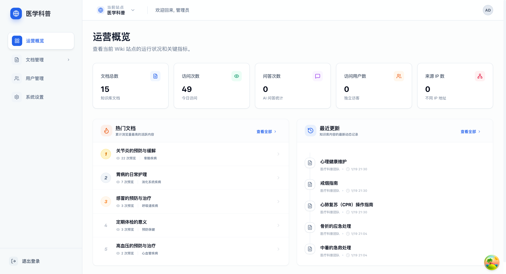
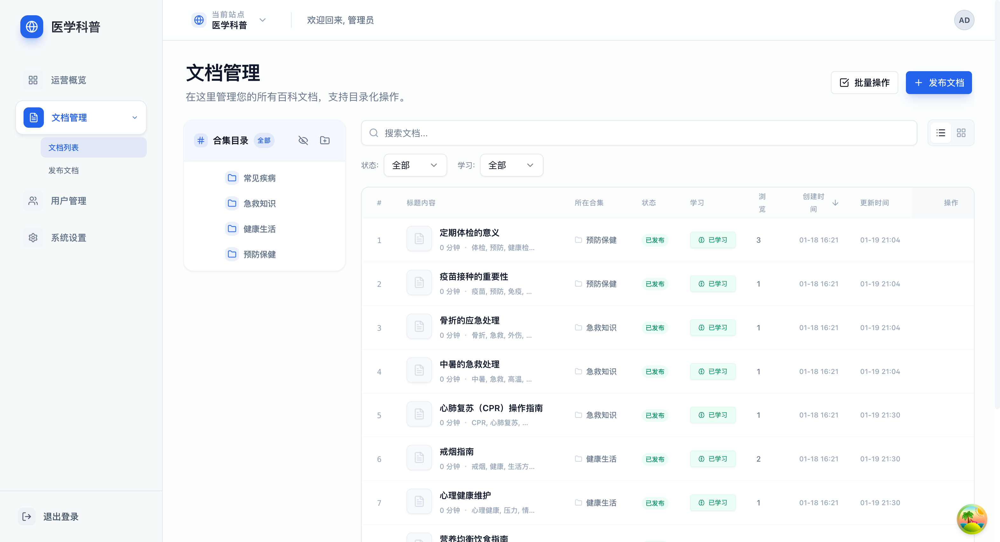
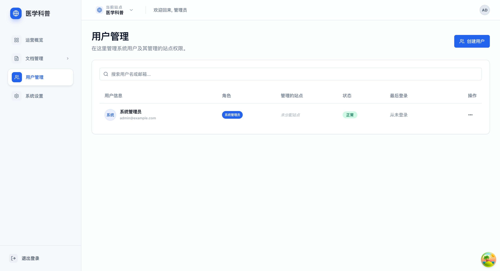
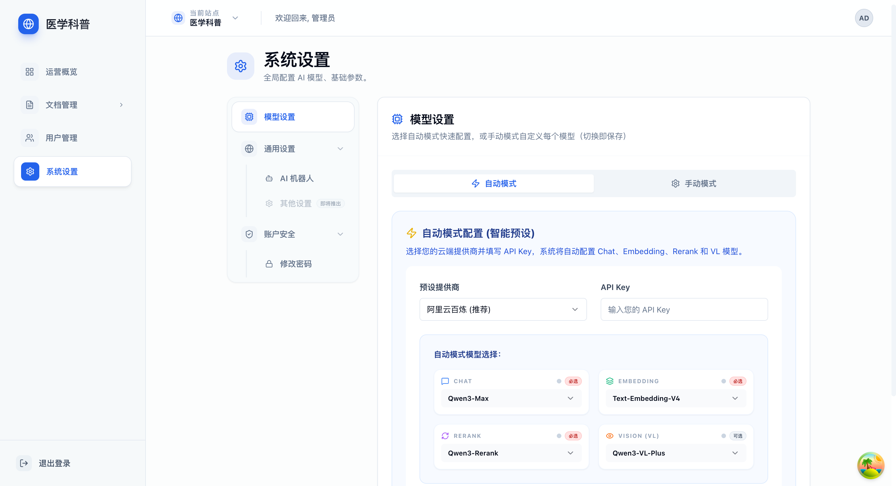
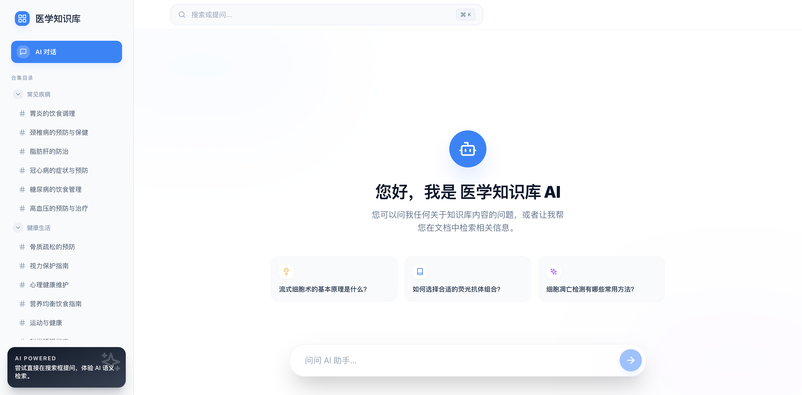

<div align="center">

#  CatWiki

**企业级AI知识库**

企业级全栈 AI 知识库平台，集成了现代化的内容管理、深度 AI 智能问答与极致的用户交互体验。

[](https://fastapi.tiangolo.com/)
[](https://nextjs.org/)
[](https://www.typescriptlang.org/)
[](https://www.postgresql.org/)


[English](./README_EN.md) | 简体中文

<p>
  <a href="https://github.com/bulolo/CatWiki">
    
  </a>
</p>

**如果这个项目对你有帮助，请点击右上角 ⭐ Star 支持一下，这是对开发者最大的鼓励！**


</div>

---

## 🚀 最近更新
### 2026-01-18 ⚡ 全新文档站点
- 🌐 **文档站点上线**: 集成了全新的 [VitePress 文档站点](http://docs.catwiki.cn) (2026-01-18)
- 📝 **多语言对齐**: 重新对齐了中英文 README 说明
- 🔧 **架构清理**: 优化了项目目录结构和 Docker 配置

---

## 🎯 项目亮点

- ✅ **开箱即用**: Docker Compose 一键启动，自动初始化数据库和演示数据
- ✅ **双端架构**: 独立的管理后台和客户端，职责清晰
- ✅ **类型安全**: 前后端全面使用 TypeScript 和 Pydantic，类型安全有保障
- ✅ **现代技术栈**: FastAPI + Next.js 14 + SQLAlchemy 2.0，使用最新技术
- ✅ **AI 集成**: 内置 AI 智能问答，支持主流大语言模型
- ✅ **热更新**: 开发环境支持前后端代码热更新
- ✅ **自动生成 SDK**: 后端 API 变更后自动生成 TypeScript SDK
- ✅ **完善的文档**: 详细的 API 文档和使用指南

---

## 📸 应用截图

### 🎯 管理后台

<table>
  <tr>
    <td width="50%">
      
      <p align="center"><b>运营概览</b><br>实时查看站点运行状态和关键指标</p>
    </td>
    <td width="50%">
      
      <p align="center"><b>文档管理</b><br>层级目录结构，支持批量操作</p>
    </td>
  </tr>
  <tr>
    <td width="50%">
      
      <p align="center"><b>用户管理</b><br>完整的用户权限和角色管理</p>
    </td>
    <td width="50%">
      
      <p align="center"><b>系统设置</b><br>灵活的 AI 模型配置</p>
    </td>
  </tr>
</table>

### 💬 客户端

<div align="center">
  
  <p><b>AI 智能问答</b> - 基于知识库内容的智能对话助手，支持上下文理解</p>
</div>

---

## ✨ 核心特性

### 🎯 管理后台
- **📝 富文本编辑**: 基于 Markdown 的文档编辑器，支持实时预览
- **🗂️ 文档管理**: 层级目录结构，支持拖拽排序
- **👥 用户管理**: 完整的用户权限和角色管理
- **🌐 多站点支持**: 支持创建和管理多个独立的知识库站点
- **🤖 AI 配置**: 灵活的 AI 模型和机器人配置

### 💬 客户端
- **🔍 智能搜索**: 快速查找所需文档和内容
- **🤖 AI 问答**: 基于知识库内容的智能对话助手
- **📱 响应式设计**: 完美适配桌面端和移动端
- **🎨 现代化 UI**: 使用 shadcn/ui 构建的优雅界面

---

## 🏗️ 技术架构

### 后端技术栈
- **框架**: FastAPI
- **数据库**: PostgreSQL + SQLAlchemy 2.0
- **迁移工具**: Alembic
- **包管理**: uv (高性能 Python 包管理器)
- **身份认证**: JWT + PassLib
- **Python 版本**: >= 3.10

### 前端技术栈
- **框架**: Next.js 14 (App Router)
- **语言**: TypeScript 5.3+
- **样式**: Tailwind CSS
- **组件库**: shadcn/ui (基于 Radix UI)
- **状态管理**: React Hooks
- **包管理**: pnpm

### 特色功能库
- **拖拽排序**: @dnd-kit/core + @dnd-kit/sortable (管理后台)
- **Markdown 编辑**: md-editor-rt (管理后台)
- **Markdown 渲染**: streamdown (客户端)
- **通知系统**: Sonner (前端通用)

---

## 📁 项目结构

```
catWiki/
├── backend/                      # 🐍 FastAPI 后端服务
│   ├── app/
│   │   ├── api/                 # API 路由 (Admin/Client)
│   │   ├── core/                # 核心配置、中间件、工具
│   │   ├── crud/                # 数据库 CRUD 操作
│   │   ├── models/              # SQLAlchemy ORM 模型
│   │   ├── schemas/             # Pydantic 验证模式
│   │   └── main.py              # 应用入口
│   ├── scripts/                 # 工具脚本（同步 SDK、初始化数据）
│   ├── Dockerfile.dev           # 开发环境镜像
│   └── pyproject.toml           # 依赖管理（uv）
│
├── frontend/
│   ├── admin/                   # 🎯 管理后台 (Next.js, 8001)
│   ├── client/                  # 💬 客户端 (Next.js, 8002)
│   └── docs/                    # 📚 文档站点 (VitePress, 8003)
│
├── deploy/                      # 🚀 生产环境部署
├── docker-compose.dev.yml       # 开发环境一键启动
├── Makefile                      # 项目管理脚本
└── README.md                    # 项目主文档
```

### 核心目录说明

| 目录 | 说明 | 技术栈 |
|------|------|--------|
| `backend/` | 后端 API 服务 | FastAPI + PostgreSQL + SQLAlchemy |
| `frontend/admin/` | 管理后台（内部使用） | Next.js 14 + shadcn/ui + Tailwind |
| `frontend/client/` | 客户端（对外展示） | Next.js 14 + AI 问答 + 搜索 |
| `frontend/docs/` | 文档站点（项目说明） | VitePress + Markdown |

---

## ⚡ 快速开始（5 分钟）

### 一键启动完整开发环境

```bash
# 克隆项目
git clone https://github.com/bulolo/CatWiki.git
cd catWiki

# 1. 初始化配置
make dev-init

# 2. 修改配置 (重要!)
# 编辑 backend/.env 填入 OpenAI API Key 等信息
# vim backend/.env

# 3. 启动开发环境
make dev-up
```

> [!WARNING]
> **关于 `make dev-init`**: 它会重新从模板复制 `.env` 文件，这会覆盖您已有的配置。
> - **第一次运行**: 请务必先运行 `make dev-init`，然后修改配置文件。
> - **后续开发**: 请直接使用 `make dev-up`。

等待 2-3 分钟，所有服务启动完成后，访问：
- 🎯 **管理后台**: http://localhost:8001 (admin@example.com / admin123)
- 💬 **客户端**: http://localhost:8002/medical
- 📚 **文档站点**: http://localhost:8003 (离线阅读此 README 及其它详细指南)
- 🛡️ **API 文档**: http://localhost:3000/docs

就这么简单！🎉

---

## 🚀 安装与配置

### 前置要求

- **Docker** >= 20.10
- **Docker Compose** >= 2.0
- **Make** (系统自带或通过包管理器安装)

---

## 🏗️ 项目管理 (Makefile)

本项目根目录提供了 `Makefile` 工具，将复杂的 Docker 维护命令封装为简单的指令。

### 核心命令

#### 通用命令
| 命令 | 说明 |
|------|------|
| `make gen-sdk` | **生成 SDK**：触发后端 API 自动生成前端 SDK |
| `make help` | **预览命令**：显示所有可用指令及其说明 |

#### 开发环境
| 命令 | 说明 |
|------|------|
| `make dev-init` | **初始化环境配置**：清理并重新从 `.env.example` 复制配置文件 |
| `make dev-up` | **开发启动**：构建镜像并在前台启动，实时查看所有服务日志 |
| `make dev-down` | **优雅停止**：停止并移除容器，保留数据库存储卷 |
| `make dev-restart` | **快捷重启**：仅重启后端应用容器 |
| `make dev-logs` | **实时日志**：查看后端核心服务的实时运行日志 |
| `make dev-db-migrate m="msg"` | **生成迁移脚本**：生成新的数据库迁移脚本（需提供备注 `m`） |
| `make dev-db-psql` | **数据库终端**：进入 PostgreSQL 交互式终端 |
| `make dev-clean` | **深度重置**：停止容器并**删除所有数据卷**（清空数据库和存储，⚠️ 危险操作） |

---

#### 生产环境

| 命令 | 说明 |
|------|------|
| `make prod-init` | **生产初始化**：初始化生产环境配置文件模板 |
| `make prod-up` | **生产启动**：在后台启动生产环境所有服务 |
| `make prod-down` | **生产停止**：停止并移除生产环境容器 |
| `make prod-restart` | **重启后端**：仅重启生产环境后端应用容器 |
| `make prod-logs` | **实时日志**：查看生产环境容器日志 |
| `make prod-clean` | **深度重置**：停止容器并**删除生产所有数据卷**（⚠️ 危险操作） |

---

## 🏗️ 技术细节

### 初始化机制
项目采用 **独立初始化容器** (`backend-init`) 模式：
- **自我检测**: 启动时自动检查数据库版本。
- **自动迁移**: 自动执行 Alembic 脚本。
- **预置数据**: 自动创建管理员 (`admin@example.com` / `admin123`) 及医学演示站点。

### 自动 SDK 同步
后端 API 变更后，只需一行命令即可更新前端 SDK：
```bash
make gen-sdk
```

---

## 📦 生产环境部署

项目提供了标准化的生产环境部署流程，通过 `make prod-xxx` 系列命令即可快速管理。

#### 1. 初始化配置
```bash
# 生成生产环境配置文件模板 (位于 deploy/docker/ 目录)
make prod-init
```

#### 2. 修改敏感信息
编辑以下文件，填入正式的域名、数据库密码、JWT 密钥等：
- `deploy/docker/.env.backend`
- `deploy/docker/.env.admin`
- `deploy/docker/.env.client`

#### 3. 启动服务
```bash
# 在后台启动所有生产环境容器
make prod-up
```

> [!IMPORTANT]
> 详细的安全配置建议（如证书配置、对象存储对接等）请参考：
> **[👉 生产环境完整部署指南 (deploy/docker/README.md)](./deploy/docker/README.md)**

---

---

## ❓ 常见问题 (FAQ)

> [!TIP]
> 遇到问题时，通常 `make dev-clean` + `make dev-up` 能解决 90% 的本地环境异常。

### Q: 为什么启动后报错 "Database not initialized"?
A: 请确认是否运行了 `make dev-init`。如果数据库已损坏，请使用 `make dev-clean` 重置。

**Q: 如何修改默认服务端口？**
A: 直接在根目录的 `docker-compose.dev.yml` 中修改对应的 `ports` 映射即可。

**Q: 客户端 API 报 404？**
A: 确保你的访问路径包含站点域名后缀，例如：`http://localhost:8002/medical`。


---

## 📚 文档

#### � 快速导航

- � [环境配置指南](./frontend/docs/docs/deployment/config/environment.md) - 开发和生产环境的完整配置说明
- 🚀 [开发快速开始](./frontend/docs/docs/development/start/quick-start.md) - 5 分钟上手开发环境
- 🔌 [API 架构细节](./frontend/docs/docs/development/api/overview.md) - Admin API 和 Client API 设计原则
- 📦 [RustFS 使用指南](./frontend/docs/docs/development/tech/rustfs.md) - 文件上传、下载、对象存储详解
- 🎯 [SDK 使用指南](./frontend/docs/docs/development/tech/sdk-usage.md) - 前端如何调用后端 API
- 🔗 [文档处理连接器](./frontend/docs/docs/development/connectors/overview.md) - 文档解析引擎对接指南

---

## 🔗 文档处理连接器

连接器（Connector）是 CatWiki 知识库平台中用于**文档预处理**的核心组件。通过连接器，您可以接入不同的文档解析引擎，将 PDF、Word、图片等非结构化文档转换为可被 AI 理解的结构化文本。

### 连接器功能

- **文档解析**: 将 PDF、Word、PPT 等文档转换为结构化文本
- **OCR 识别**: 识别扫描件和图片中的文字内容
- **版面分析**: 识别文档结构（标题、段落、表格、图片等）
- **格式保留**: 尽可能保留原文档的格式和层次结构

### 支持的连接器

| 连接器 | 说明 | 特点 |
|--------|------|------|
| [Docling](./frontend/docs/docs/development/connectors/docling.md) | IBM 开源文档处理引擎 | 轻量级、易部署 |
| [MinerU](./frontend/docs/docs/development/connectors/mineru.md) | 高质量文档解析工具 | 解析精度高、支持复杂版面 |
| [PaddleOCR](./frontend/docs/docs/development/connectors/paddleocr.md) | 百度 OCR 引擎 | OCR 能力强、支持多语言 |
| [天枢](./frontend/docs/docs/development/connectors/tianshu.md) | 天枢文档解析引擎 | 国产引擎、中文优化 |

> 详细配置请参考 [文档处理连接器指南](./frontend/docs/docs/development/connectors/overview.md)

---

## 📄 许可证

本项目采用 **GNU Affero General Public License v3.0 (AGPL-3.0)** 许可证。

### 📋 许可证说明

- ✅ **自由使用**: 你可以自由使用、修改和分发本软件
- ✅ **开源要求**: 你必须以相同的许可证开源你的修改
- ✅ **网络服务**: 如果你通过网络提供服务，也必须开源你的代码
- ✅ **商业使用**: 允许商业使用，但需要遵守相同的开源要求

这意味着如果你：
- 🔧 **修改了代码**: 必须开源修改后的代码
- 🌐 **提供 SaaS 服务**: 必须向用户提供完整源代码
- 💼 **商业化运营**: 可以，但必须保持开源

详见 [LICENSE](LICENSE) 文件获取完整许可证文本。

### 🤔 为什么选择 AGPL-3.0？

我们选择 AGPL-3.0 是为了：
1. 保护开源社区的利益，防止闭源商业化
2. 确保所有改进都能回馈给社区
3. 即使是网络服务形式，用户也能获得源代码

---

## 📮 联系方式

- 💬 **问题反馈**: 通过 [GitHub Issues](https://github.com/bulolo/CatWiki/issues) 提交
- 📧 **商务合作**: 82607314@qq.com/ bulolo(微信)
- 🌐 **官方网站**: http://catwiki.cn

---

<div align="center">

**⭐ 如果这个项目对您有帮助，请给我们一个 Star！**

Made with ❤️ by CatWiki Team

</div>