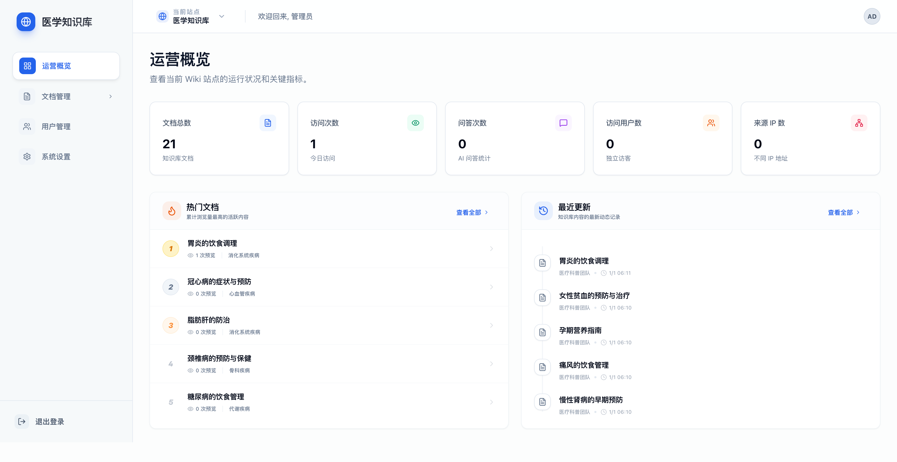
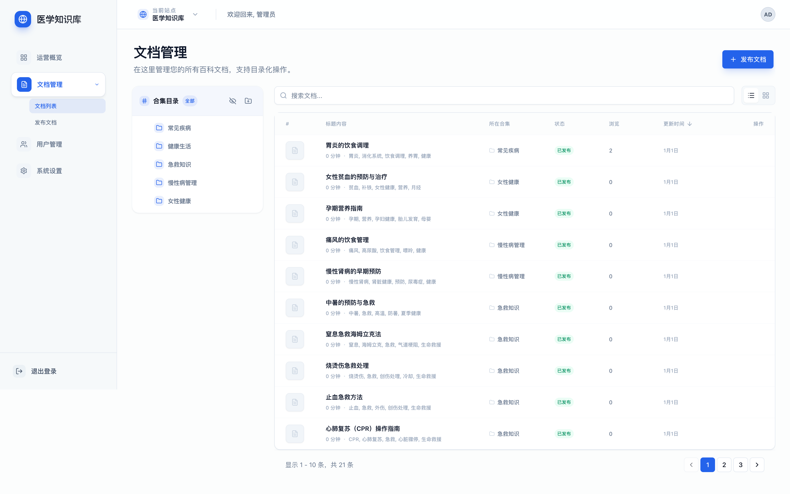
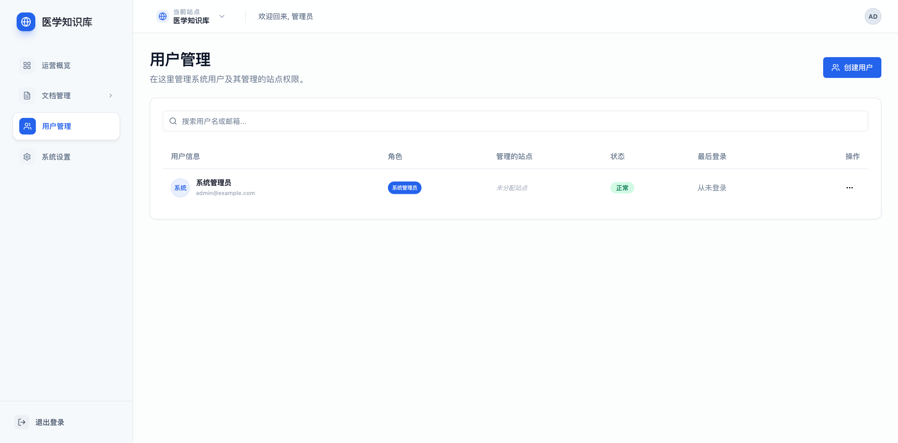
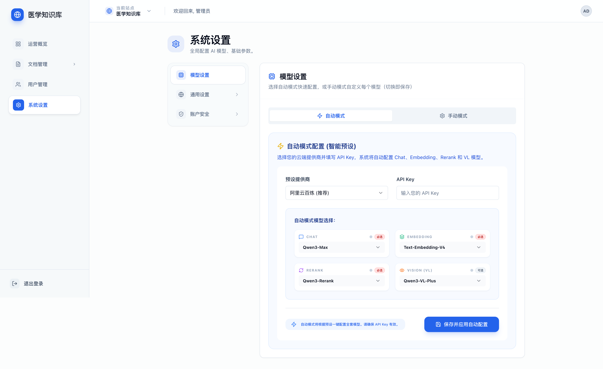
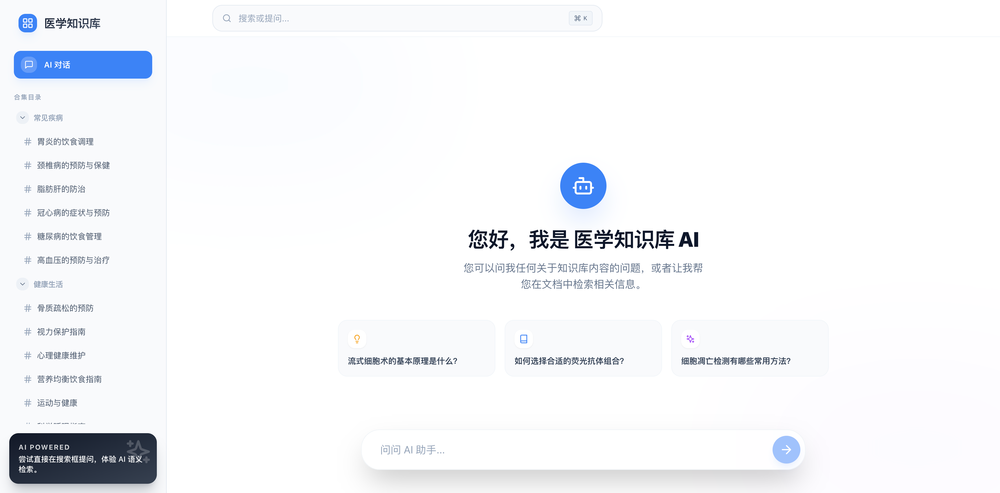

<div align="center">

#  CatWiki / 知几喵

**企业级知识库管理系统**

一个功能完善的知识库平台，提供强大的内容管理、AI 智能问答和现代化的用户体验

[](https://fastapi.tiangolo.com/)
[](https://nextjs.org/)
[](https://www.typescriptlang.org/)
[](https://www.postgresql.org/)


[English](./README_EN.md) | 简体中文

<p>
  <a href="https://github.com/bulolo/CatWiki">
    
  </a>
</p>

**如果这个项目对你有帮助，请点击右上角 ⭐ Star 支持一下，这是对开发者最大的鼓励！**


</div>

---

## 🚀 最近更新
### 2025-01-17 ⚡ 多语言支持
- 🌐 **多语言支持**: 新增英文文档说明 [README_EN.md](./README_EN.md) (2026-01-17)
- 📝 **文档完善**: 更新了项目架构说明和快速开始指南

---

## 🎯 项目亮点

- ✅ **开箱即用**: Docker Compose 一键启动，自动初始化数据库和演示数据
- ✅ **双端架构**: 独立的管理后台和客户端，职责清晰
- ✅ **类型安全**: 前后端全面使用 TypeScript 和 Pydantic，类型安全有保障
- ✅ **现代技术栈**: FastAPI + Next.js 14 + SQLAlchemy 2.0，使用最新技术
- ✅ **AI 集成**: 内置 AI 智能问答，基于 Vercel AI SDK
- ✅ **热更新**: 开发环境支持前后端代码热更新
- ✅ **自动生成 SDK**: 后端 API 变更后自动生成 TypeScript SDK
- ✅ **完善的文档**: 详细的 API 文档和使用指南

---

## 📸 应用截图

### 🎯 管理后台

<table>
  <tr>
    <td width="50%">
      
      <p align="center"><b>运营概览</b><br>实时查看站点运行状态和关键指标</p>
    </td>
    <td width="50%">
      
      <p align="center"><b>文档管理</b><br>层级目录结构，支持批量操作</p>
    </td>
  </tr>
  <tr>
    <td width="50%">
      
      <p align="center"><b>用户管理</b><br>完整的用户权限和角色管理</p>
    </td>
    <td width="50%">
      
      <p align="center"><b>系统设置</b><br>灵活的 AI 模型配置</p>
    </td>
  </tr>
</table>

### 💬 客户端

<div align="center">
  
  <p><b>AI 智能问答</b> - 基于知识库内容的智能对话助手，支持上下文理解</p>
</div>

---

## ✨ 核心特性

### 🎯 管理后台
- **📝 富文本编辑**: 基于 Markdown 的文档编辑器，支持实时预览
- **🗂️ 文档管理**: 层级目录结构，支持拖拽排序
- **👥 用户管理**: 完整的用户权限和角色管理
- **🌐 多站点支持**: 支持创建和管理多个独立的知识库站点
- **🤖 AI 配置**: 灵活的 AI 模型和机器人配置

### 💬 客户端
- **🔍 智能搜索**: 快速查找所需文档和内容
- **🤖 AI 问答**: 基于知识库内容的智能对话助手
- **📱 响应式设计**: 完美适配桌面端和移动端
- **🎨 现代化 UI**: 使用 shadcn/ui 构建的优雅界面

---

## 🏗️ 技术架构

### 后端技术栈
- **框架**: FastAPI
- **数据库**: PostgreSQL + SQLAlchemy 2.0
- **迁移工具**: Alembic
- **包管理**: uv (高性能 Python 包管理器)
- **身份认证**: JWT + PassLib
- **Python 版本**: >= 3.10

### 前端技术栈
- **框架**: Next.js 14 (App Router)
- **语言**: TypeScript 5.3+
- **样式**: Tailwind CSS
- **组件库**: shadcn/ui (基于 Radix UI)
- **状态管理**: React Hooks
- **包管理**: pnpm

### 特色功能库
- **拖拽排序**: @dnd-kit/core + @dnd-kit/sortable (管理后台)
- **Markdown 编辑**: md-editor-rt (管理后台)
- **AI 集成**: Vercel AI SDK (ai + @ai-sdk/react) (客户端)
- **Markdown 渲染**: streamdown (客户端)
- **通知系统**: Sonner (前端通用)

---

## 📁 项目结构

```
catWiki/
├── backend/                      # 🐍 FastAPI 后端服务
│   ├── app/
│   │   ├── api/                 # API 路由
│   │   │   ├── admin/          # 管理后台 API（完整 CRUD + 认证）
│   │   │   └── client/         # 客户端 API（只读 + 公开）
│   │   ├── core/                # 核心配置、中间件、工具
│   │   ├── crud/                # 数据库 CRUD 操作
│   │   ├── models/              # SQLAlchemy ORM 模型
│   │   ├── schemas/             # Pydantic 验证模式
│   │   └── main.py              # 应用入口
│   ├── alembic/                 # 数据库迁移
│   ├── scripts/                 # 工具脚本（创建用户、生成 SDK、初始化数据）
│   ├── Dockerfile.dev           # 开发环境镜像
│   ├── Dockerfile.prod          # 生产环境镜像
│   └── pyproject.toml           # 依赖管理（uv）
│
├── frontend/
│   ├── admin/                   # 🎯 管理后台（Next.js，端口 3000）
│   │   └── src/
│   │       ├── app/            # 页面路由
│   │       ├── components/     # React 组件
│   │       │   ├── features/  # 业务组件（文档编辑、用户管理）
│   │       │   ├── layout/    # 布局组件（侧边栏、登出）
│   │       │   └── ui/        # shadcn/ui 基础组件
│   │       ├── lib/sdk/       # 自动生成的 TypeScript SDK
│   │       └── hooks/         # 自定义 React Hooks
│   │
│   └── client/                  # 💬 客户端前端（Next.js，端口 3001）
│       └── src/
│           ├── app/            # 页面路由
│           ├── components/     # React 组件
│           │   ├── ai/        # AI 对话组件
│           │   └── features/  # 文档展示、搜索
│           ├── lib/sdk/       # 自动生成的 TypeScript SDK
│           └── layout/        # 侧边栏、站点切换
│
├── deploy/                      # 🚀 生产环境部署
│   ├── docker/                 # Docker Compose 部署
│   │   ├── docker-compose.prod.yml
│   │   └── README.md           # 生产部署说明
│   └── README.md               # 部署概览文档
│
├── docker-compose.dev.yml       # 开发环境一键启动
├── LICENSE                      # AGPL-3.0 许可证
└── README.md                    # 项目文档
```

### 核心目录说明

| 目录 | 说明 | 技术栈 |
|------|------|--------|
| `backend/` | 后端 API 服务 | FastAPI + PostgreSQL + SQLAlchemy |
| `frontend/admin/` | 管理后台（内部使用） | Next.js 14 + shadcn/ui + Markdown 编辑器 |
| `frontend/client/` | 客户端（对外展示） | Next.js 14 + AI 问答 + 搜索 |
| `deploy/` | 生产环境部署配置 | Docker Compose |

---

## ⚡ 快速开始（5 分钟）

### 一键启动完整开发环境

```bash
# 克隆项目
git clone https://github.com/yourusername/catWiki.git
cd catWiki

# 1. 首次启动 (初始化配置 + 启动环境)
make setup

# 2. 日常开发 (仅启动环境，不重置配置)
make dev

# 3. 修改配置 (可选)
# 如果需要 AI 功能，请编辑 backend/.env 填入 OpenAI API Key
# 修改变量后运行 `make restart` 重启后端即可生效
```

> [!WARNING]
> **关于 `make setup`**: 它会重新从模板复制 `.env` 文件，这会覆盖您已有的配置。
> - **第一次运行**: 请使用 `make setup`。
> - **后续开发**: 请直接使用 `make dev`。

等待 2-3 分钟，所有服务启动完成后，访问：
- 🎯 **管理后台**: http://localhost:8001  
  使用 `admin@example.com` / `admin123` 登录
- 💬 **客户端**: http://localhost:8002/medical  
  查看 Demo 医学科普，包含 5 篇医学文档
- 📚 **API 文档**: http://localhost:3000/docs  
  交互式 API 文档

就这么简单！🎉

---

## 🚀 安装与配置

### 前置要求

- **Docker** >= 20.10
- **Docker Compose** >= 2.0
- **Make** (系统自带或通过包管理器安装)

---

## 🏗️ 项目管理 (Makefile)

本项目根目录提供了 `Makefile` 工具，将复杂的 Docker 维护命令封装为简单的指令。

### 核心命令

#### 开发环境

| 命令 | 说明 |
|------|------|
| `make setup` | **一键启动开发环境**：执行 `init-env` 并启动 `dev` 服务 |
| `make init-env` | **初始化环境配置**：清理并重新从 `.env.example` 复制配置文件 |
| `make dev` | **开发启动**：构建镜像并在前台启动，实时查看所有服务日志 |
| `make down` | **优雅停止**：停止并移除容器，保留数据库存储卷 |
| `make restart` | **快捷重启**：仅重启后端应用容器 |
| `make logs` | **实时日志**：查看后端核心服务的实时运行日志 |
| `make db-migrate m="msg"` | **生成迁移脚本**：生成新的数据库迁移脚本（需提供备注 `m`） |
| `make db-psql` | **数据库终端**：进入 PostgreSQL 交互式终端 |
| `make gen-sdk` | **生成 SDK**：触发后端 API 自动生成前端 SDK |
| `make clean` | **深度重置**：停止容器并**删除所有数据卷**（清空数据库和存储，⚠️ 危险操作） |

---

#### 生产环境

| 命令 | 说明 |
|------|------|
| `make prod-init` | **生产初始化**：初始化生产环境配置文件模板 |
| `make prod-up` | **生产启动**：在后台启动生产环境所有服务 |
| `make prod-down` | **生产停止**：停止并移除生产环境容器 |
| `make prod-restart` | **重启后端**：仅重启生产环境后端应用容器 |
| `make prod-logs` | **实时日志**：查看生产环境容器日志 |
| `make prod-clean` | **深度重置**：停止容器并**删除生产所有数据卷**（⚠️ 危险操作） |

---

## 🏗️ 技术细节

### 初始化机制
项目采用 **独立初始化容器** (`backend-init`) 模式：
- **自我检测**: 启动时自动检查数据库版本。
- **自动迁移**: 自动执行 Alembic 脚本。
- **预置数据**: 自动创建管理员 (`admin@example.com` / `admin123`) 及医学演示站点。

### 自动 SDK 同步
后端 API 变更后，只需一行命令即可更新前端 SDK：
```bash
make gen-sdk
```

---

## 📦 生产环境部署

项目提供了标准化的生产环境部署流程，通过 `make prod-xxx` 系列命令即可快速管理。

#### 1. 初始化配置
```bash
# 生成生产环境配置文件模板 (位于 deploy/docker/ 目录)
make prod-init
```

#### 2. 修改敏感信息
编辑以下文件，填入正式的域名、数据库密码、JWT 密钥等：
- `deploy/docker/.env.backend`
- `deploy/docker/.env.admin`
- `deploy/docker/.env.client`

#### 3. 启动服务
```bash
# 在后台启动所有生产环境容器
make prod-up
```

> [!IMPORTANT]
> 详细的安全配置建议（如证书配置、对象存储对接等）请参考：
> **[👉 生产环境完整部署指南 (deploy/docker/README.md)](./deploy/docker/README.md)**

---

---

## ❓ 常见问题 (FAQ)

> [!TIP]
> 遇到问题时，通常 `make clean` + `make dev` 能解决 90% 的本地环境异常。

**Q: 为什么管理后台登录不上？**
A: 请确认是否运行了 `make init-env`。如果数据库已损坏，请使用 `make clean` 重置。

**Q: 如何修改默认服务端口？**
A: 直接在根目录的 `docker-compose.dev.yml` 中修改对应的 `ports` 映射即可。

**Q: 客户端 API 报 404？**
A: 确保你的访问路径包含站点域名后缀，例如：`http://localhost:8002/medical`。


---

## 📚 文档

### 📂 文档目录结构

```
docs/                                          # 📁 项目文档中心
├── ENV_CONFIG.md                              # 环境变量配置完整指南

backend/app/
├── api/README.md                              # API 架构设计文档
└── core/RUSTFS_USAGE.md                       # RustFS 对象存储使用指南

frontend/
├── admin/src/lib/SDK_USAGE.md                 # Admin 管理后台 SDK 使用指南
└── client/src/lib/SDK_USAGE.md                # Client 客户端 SDK 使用指南

deploy/
└── docker/README.md                           # 生产环境 Docker 部署指南
```

### 🚀 快速导航

#### 新手入门
1. 📖 [环境变量配置指南](./docs/ENV_CONFIG.md) - 开发和生产环境的完整配置说明
2. 🚀 [生产环境部署指南](./deploy/docker/README.md) - Docker Compose 和 Kubernetes 部署

#### 后端开发
- 🔌 [API 架构说明](./backend/app/api/README.md) - Admin API 和 Client API 设计原则
- 📦 [RustFS 使用指南](./backend/app/core/RUSTFS_USAGE.md) - 文件上传、下载、对象存储详解
- 🐍 [后端模块文档](./backend/README.md) - 后端项目结构和开发指南

#### 前端开发
- 🎯 [Admin SDK 使用指南](./frontend/admin/src/lib/SDK_USAGE.md) - 管理后台 SDK 使用和示例
- 💬 [Client SDK 使用指南](./frontend/client/src/lib/SDK_USAGE.md) - 客户端 SDK 使用和示例
- 🎨 [管理后台文档](./frontend/admin/README.md) - Admin 前端项目说明
- 🌐 [客户端文档](./frontend/client/README.md) - Client 前端项目说明

---

## 📄 许可证

本项目采用 **GNU Affero General Public License v3.0 (AGPL-3.0)** 许可证。

### 📋 许可证说明

- ✅ **自由使用**: 你可以自由使用、修改和分发本软件
- ✅ **开源要求**: 你必须以相同的许可证开源你的修改
- ✅ **网络服务**: 如果你通过网络提供服务，也必须开源你的代码
- ✅ **商业使用**: 允许商业使用，但需要遵守相同的开源要求

这意味着如果你：
- 🔧 **修改了代码**: 必须开源修改后的代码
- 🌐 **提供 SaaS 服务**: 必须向用户提供完整源代码
- 💼 **商业化运营**: 可以，但必须保持开源

详见 [LICENSE](LICENSE) 文件获取完整许可证文本。

### 🤔 为什么选择 AGPL-3.0？

我们选择 AGPL-3.0 是为了：
1. 保护开源社区的利益，防止闭源商业化
2. 确保所有改进都能回馈给社区
3. 即使是网络服务形式，用户也能获得源代码

---

## 📮 联系方式

- 💬 **问题反馈**: 通过 [GitHub Issues](https://github.com/bulolo/CatWiki/issues) 提交
- 📧 **商务合作**: 82607314@qq.com/ bulolo(微信)
- 🌐 **官方网站**: http://catwiki.cn

---

<div align="center">

**⭐ 如果这个项目对您有帮助，请给我们一个 Star！**

Made with ❤️ by CatWiki Team

</div>