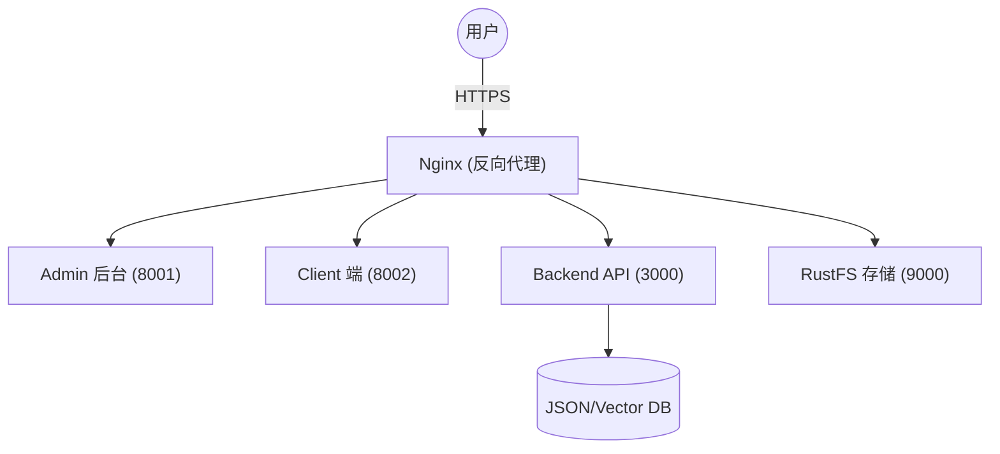

# Docker 生产部署指南

本文档提供基于 Docker 的生产环境详细部署说明。CatWiki 采用容器化部署，通过 Nginx 实现反向代理与 HTTPS 安全接入。

## 📋 前置要求

- **服务器**: Linux 服务器（推荐 Ubuntu 22.04+）
- **软件**: Docker >= 20.10, Docker Compose >= 2.0, Make
- **域名**: 建议准备 3-4 个二级域名分别指向各服务

## 🏗️ 生产架构



## 🚀 部署流程

### 1. 初始化环境
```bash
git clone https://github.com/bulolo/CatWiki.git
cd catWiki

# 生成生产环境配置模板
make prod-init
```

### 2. 修改生产配置 (⚠️ 关键)
进入 `deploy/docker/` 目录，编辑生成的 `.env.*` 文件。

#### 后端核心配置 (`.env.backend`)
| 配置项 | 说明 | 建议 |
| :--- | :--- | :--- |
| `POSTGRES_PASSWORD` | 数据库密码 | **务必修改** |
| `SECRET_KEY` | JWT 签名密钥 | **务必修改** (至少 32 位随机字符) |
| `RUSTFS_ROOT_PASSWORD` | 对象存储超级密码 | **务必修改** |
| `BACKEND_CORS_ORIGINS=["https://admin.catwiki.ai","https://demo.catwiki.ai","https://docs.catwiki.ai","https://catwiki.ai"]
| `RUSTFS_PUBLIC_URL` | 文件对外访问链接 | 指向您的 OSS 域名 (如 https://files.catwiki.ai) |

#### 前端配置 (`.env.admin` / `.env.client`)
确保 `NEXT_PUBLIC_API_URL` 指向您的生产 API 域名。

### 3. 一键启动
```bash
# 启动所有生产容器（后台运行）
make prod-up
```
> [!NOTE]
> `make prod-up` 正会自动触发 `backend-init` 容器执行数据库迁移与基础数据注入。

---

## 🛠️ 生产维护命令 (CLI Reference)

| 命令 | 说明 |
|------|------|
| `make prod-up` | **启动服务**：构建并以后台模式拉起生产全栈 |
| `make prod-rebuild` | **无损重建**：不使用缓存强制重新构建并拉起 |
| `make prod-down` | **停止服务**：停止并移除容器（数据持久化在 Volume 中） |
| `make prod-restart` | **快重重启**：仅重启后端后端容器 |
| `make prod-logs` | **查看日志**：实时聚合查看所有生产容器日志 |
| `make prod-clean` | **🚨 危险：彻底重置**：删除容器及所有持久化数据 |

---

## 🛡️ 安全与备份

### 默认账户
部署完成后，请使用初始账号登录并立即修改密码：
- **账号**: `admin@example.com`
- **密码**: `admin123`

### 自动备份脚本建议
建议通过 crontab 定期执行以下备份逻辑：
```bash
# 数据库备份示例
docker exec catwiki-postgres pg_dump -U postgres catwiki > backup.sql
```
