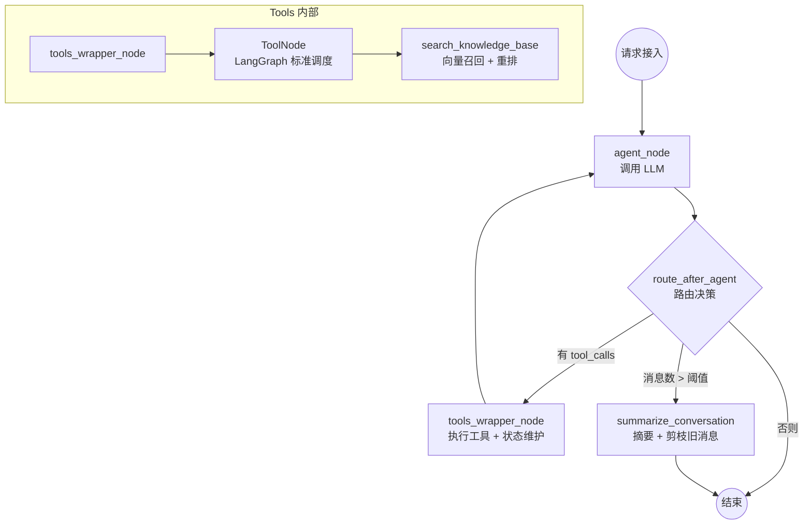

# AI 对话与知识库检索核心架构

本文档描述 CatWiki AI 对话系统的底层架构与处理机制，覆盖后端推理引擎、SSE 协议、前端消费链路及状态持久化。

---

## 1. 顶层架构

系统采用 **ReAct (Reasoning and Acting)** 范式，核心引擎基于 [LangGraph](https://langchain-ai.github.io/langgraph/) 构建有状态图工作流。

### 1.1 两条 API 路径

系统对外暴露两个入口，共享同一套 `generate_chat_chunks` 核心逻辑，仅 SSE 序列化层不同：

```
┌─────────────────────────────────────────────────────────────────┐
│  POST /v1/chat/completions                                       │
│  process_chat_request                                            │
│    └─ _generate_graph_chunks ─► _stream_as_openai_sse ─► SSE   │
│         (OpenAI 兼容格式：data: {"choices":[...]})              │
│         include_internal_events 可由调用方控制                   │
└─────────────────────────────────────────────────────────────────┘

┌─────────────────────────────────────────────────────────────────┐
│  POST /v1/chat/responses                                         │
│  process_responses_request                                       │
│    └─ _generate_graph_chunks ─► stream_responses_api ─► SSE    │
│         (Responses API 格式：response.output_text.delta 等)     │
│         include_internal_events 固定 True；emit_usage 受        │
│         show_pipeline_trace 控制                                 │
└─────────────────────────────────────────────────────────────────┘
```

### 1.2 完整请求链路（以 Responses API 路径为例）

```
Client
  │  POST /v1/chat/responses
  ▼
process_responses_request
  │  解析 input / instructions / filter
  ▼
initialize_chat_context  →  返回 ChatContext(llm, initial_state, config)
  │  租户 tenant_id 解析 → set_current_tenant
  │  LLM 实例构建（ConfigResolver 读取 AI 配置）
  │  ChatSession 创建/更新；用户消息写入 chat_messages
  ▼
_generate_graph_chunks          ← 图执行 + 原始 chunk 产出
  │  async with get_checkpointer() as cp
  │  graph = create_agent_graph(checkpointer=cp, model=ctx.llm)
  │  generate_chat_chunks(graph, ...)
  │    └─ _run_graph_stream(graph.astream_events, timeout=CHAT_STREAM_TIMEOUT_SECONDS)
  │       处理事件：on_chat_model_stream / on_tool_start / on_tool_end
  │  [可选] emit_usage=True 时追加 make_usage_chunk
  ▼
stream_responses_api            ← Responses API SSE 序列化层
  │  chunk_to_responses_events 把 ChatCompletionChunk / status dict 翻译为 SSE 行
  ▼
useAIChat (React Hook)          ← 前端 SSE 消费
  │  逐事件更新占位 assistant Message
  ▼
persist_chat_turn               ← BackgroundTask，主线程结束后异步落库
```

> **断连取消**：`_run_graph_stream` 把 `graph.astream_events` 包在独立 `asyncio.Task` 里。
> 客户端断连时 Starlette → `CancelledError` → generator `finally` → `task.cancel()`，
> 将取消信号精确注入 producer 当前阻塞的 LLM API `await`，避免后端无效计算。
> `TimeoutError` 通过 `_exc: list[BaseException]` 持有列表传递，不会被 `except Exception` 吞掉。

### 1.3 LangGraph 状态机拓扑（当前 3 节点）



> **路由逻辑**（`route_after_agent`）：
> 1. 最后一条消息有 `tool_calls` → `"tools"`（即使已超迭代上限，也让 `tools_wrapper_node` 注入 FORCE_STOP 指令，确保 Agent 收到 ToolMessage 后能生成最终回复）
> 2. 非 System 消息数超过 `AGENT_SUMMARY_TRIGGER_MSG_COUNT` → `"summarize_conversation"`
> 3. 否则 → `"__end__"`

---

## 2. 知识检索管道（RAG Pipeline）

### 2.1 两级检索

| 阶段 | 说明 |
|---|---|
| **语义海选（Recall）** | 按 `site_id` 做租户硬隔离，从向量库语义召回 `RAG_RECALL_K`（默认 50）个片段，按 `RAG_RECALL_THRESHOLD` 做相似度过滤 |
| **重排细选（Rerank）** | 将候选片段交给 Reranker 打分，取 Top `RAG_RERANK_TOP_K`（默认 5），`RAG_ENABLE_RERANK=false` 时跳过此阶段 |

### 2.2 片段合并与全局编号

**片段合并**：同一文档的多个向量片段在工具返回前按 `document_id` 合并为连贯段落（`"\n\n[...]\n\n"` 分隔），避免 LLM 接收到割裂上下文。

**全局 source_offset**：多轮工具调用时编号不从 1 重置，而是由 Graph State 里的 `source_offset` 累加。例如第一次检索出 3 篇文档（编号 1–3），第二次检索结果强制从 4 开始，确保 AI 的引用标注不错乱。

### 2.3 防死循环保险

`tools_wrapper_node` 维护三道防线：

| 变量 | 含义 | 触发后行为 |
|---|---|---|
| `iteration_count >= AGENT_MAX_ITERATIONS` | 超出最大迭代次数 | 注入 `FORCE_STOP_PROMPT` ToolMessage |
| `consecutive_empty_count >= AGENT_MAX_CONSECUTIVE_EMPTY` | 连续空结果 | 同上 |
| `content_hash in seen_hashes` | 工具返回完全相同 | 将 `consecutive_empty_count` 直接拉满 |

---

## 3. SSE 事件协议（Responses API）

后端通过 `stream_responses_api` 将内部事件翻译为 OpenAI Responses API 格式。前端 `useAIChat` 按此序列处理：

```
response.created          → 更新 threadId（使用服务端 response_id）

[工具调用轮次，可有多个]
response.tool_call.started    → 显示工具调用 pill（running 状态）
response.tool_call.delta  ×N  → 累积 id / name / arguments
response.tool_call.completed  → 写入 elapsedMs / chunkCount（trace 开启时）

response.output_text.delta  ×N → 流式追加文本内容

response.knowledge_sources    → 写入引用来源列表
response.pipeline_trace       → 写入 TTFB / 首字 / 总耗时（站点 show_pipeline_trace=true 时）
response.completed            → 始终携带 usage；前端仅在收到 pipeline_trace 时渲染

data: [DONE]
```

> **工具调用配对**（`_ToolCallTracker`）：`astream_events` 在 `on_chat_model_stream` 里给 `tool_call_id`，在 `on_tool_start/end` 里给 `run_id`，两者不同步。后端用 FIFO 队列将它们配对，确保每个 `on_tool_end` 都能取到正确的 `tool_call_id` 以注入 `elapsed_ms`，并行工具场景下也不会错位。

---

## 4. 前端历史消息格式化（`formatHistoryMessages`）

历史记录从 API 拉取时为原始 OpenAI 格式（`user` / `assistant` / `tool` 三种 role 的扁平列表）。`formatHistoryMessages` 用 `reduce` 将其转换为前端 `Message[]`：

- **ReAct 合并**：一轮推理产生多条 `assistant` 行（中间行带 `tool_calls`，最终行带 `content`），合并为前端一条消息，`toolCalls` 从中间行聚合
- **边界重置**：遇到新的 `user` 消息时主动重置累加器，防止上一轮异常中断的状态泄漏
- **不可变更新**：全程通过 `Acc` 累加器的纯函数映射完成，不修改原始数据

---

## 5. 状态持久化双轨制

| 轨道 | 存储 | 用途 |
|---|---|---|
| **运行态 Checkpointer** | SQLite / Postgres（LangGraph 原生） | 保存图的二进制 checkpoint，支持上下文记忆和断点续跑 |
| **审计态 History** | `chat_messages` 表（OpenAI 格式明文） | 历史回看、`message_seq` 定位、`elapsed_ms` / `trace` 落库 |

历史存储通过 `BackgroundTasks.add_task(persist_chat_turn, ...)` 在主响应流结束后异步进行，不阻塞前端渲染。

`ChatHistoryService.resolve_assistant_message_id` 实现 `(thread_id, message_seq)` → `chat_message_id` 的解析，带 4 次重试窗口（最大累计 ~1.4 s），用于用户点击 👍/👎 时精确定位反馈目标消息。

---

## 6. 日志与可观测性

| 日志点 | 级别 | 触发时机 |
|---|---|---|
| AI Stack 快照 | DEBUG | 每次请求初始化，输出当前租户的完整模型配置（ConfigResolver） |
| RAG Query | DEBUG | 每次工具调用，输出搜索词 + site_id + offset |
| Turn Done | INFO | 单次检索结束，输出召回数 → 精排数 |
| RAG Pipeline Summary | INFO | 整个生成器结束时调用 `_log_rag_summary`，输出聚合耗时成绩单 |
| Timing Card | INFO | finally 块调用 `emit_chat_timing_card`，输出 TTFB / 首字 / 各工具阶段耗时 |

---

## 7. 环境变量参数表

### RAG 检索

| 环境变量 | 默认值 | 说明 |
|---|---|---|
| `RAG_RECALL_K` | `50` | 向量语义海选池大小 |
| `RAG_RECALL_THRESHOLD` | `0.3` | 相似度过滤阈值，提高可减少噪声但可能漏边缘结果 |
| `RAG_ENABLE_RERANK` | `true` | 是否启用重排；资源受限时可关闭 |
| `RAG_RERANK_TOP_K` | `5` | 最终送给 LLM 的精排结果数量 |
| `RAG_RECALL_MAX` | `100` | 全局召回硬上限（保护性能） |

### Agent 推理

| 环境变量 | 默认值 | 说明 |
|---|---|---|
| `AGENT_MAX_ITERATIONS` | `5` | ReAct 最大迭代轮次 |
| `AGENT_MAX_CONSECUTIVE_EMPTY` | `2` | 连续空结果后强制停止阈值 |
| `AGENT_SUMMARY_TRIGGER_MSG_COUNT` | `10` | 触发对话摘要的消息数量阈值 |
| `AGENT_SUMMARY_KEEP_LAST_N` | `6` | 摘要后保留的最近消息条数 |
| `CHAT_STREAM_TIMEOUT_SECONDS` | `120.0` | 单次流式对话超时上限（秒），超时后向客户端发送超时提示 |

---

## 8. 单元测试

LangGraph 节点测试见 `backend/tests/unit/test_graph_logic.py`。节点逻辑已提取为模块级函数（带 keyword-only 依赖参数），可在不组装完整 Graph 的情况下直接注入 mock。
