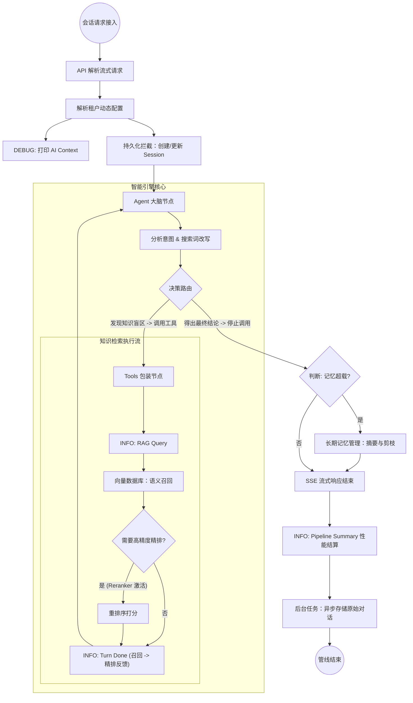

# AI 对话与知识库检索核心架构

本文档详细介绍了 CatWiki AI 对话系统的底层架构与处理机制。系统基于检索增强生成 (RAG) 和多轮推理逻辑构建，旨在提供高精确度、强上下文感知的智能问答服务。

## 1. 顶层架构地图 (Architecture Overview)

系统采用 **ReAct (Reasoning and Acting)** 范式，核心引擎基于 [LangGraph](https://langchain-ai.github.io/langgraph/) 构建了一个支持外挂工具的有状态图工作流（StateGraph）。

### 1.1 状态机工作流拓扑
整个会话服务是一条由状态驱动的管线，其中 `Agent` 扮演大脑，`Router` 负责调度，`Tools` (如 RAG) 提供感官输入。

---

## 2. 核心工作机制解析

### 2.1 ReAct 推理引擎
- **意图识别与改写 (Query Rewriting)**: 当用户输入诸如“上面提到的那步力气要多大”这样口语化或代词模糊的问题时，Agent 首先会结合全量对话历史进行**意图对齐**。它并非直接拿原话去搜，而是通过内部逻辑将问题改写为高信息熵的检索词（如：“心肺复苏 胸外按压 深度 厘米”），这极大地提升了下游向量检索的命中率。
- **循环机制 (Reasoning Loop)**:
  - 若需要查资料，则携带改写后的 Keywords 进入 `Tools` 分支；
  - 查得资料后，图谱会重新回到 `Agent` 节点，由 LLM 综合现有资料继续判断（是否还需要追问别的细节）。
- **保险措施**: 为防止模型死循环产生“幻觉抽搐”，`Tools` 层加入了硬编码的 `iteration_count` 监控拦截器。

### 2.2 知识检索管道 (RAG Pipeline)
当 Agent 决定求助于外部知识时，检索动作分为两级：
1. **语义海选 (Recall)**
   - 依赖底层的 VectorStore。
   - 策略：系统通过 `site_id` 进行租户数据硬隔离。为了保证精度，召回池（`recall_k`）设定得更深。
2. **重排细选 (Rerank)**
   - 针对第一层筛选出的大量候选者进行深度重算。
   - 策略：系统在下发任务给 Reranker 之前，会先做租户级可用性校验；最终只吐出高得分的 Top K 片段（默认 5），极大地保护了 LLM 对有效信息的聚焦力。

---

## 3. 引用的“加工厂”机制 (Citation Synthesis)

为什么日志里查出了 6 个知识片段，到了前端展示为什么却变成了“引用来源（3）”？这是由于系统进行了专业的数据清洗。

### 3.1 碎片缝合 (Content Merging)
向量切片（Chunking）机制会导致同一篇文章被切成多块。如果直接将这些块喂给大模型，答案会显得啰嗦且引用重复。
> **内部处理**：工具执行层会通过 `document_id` 将属于**同一篇文章**的散落片段拼缝在一起，形成连贯段落。系统将这几个片段作为一个统一体喂给模型。

### 3.2 全局递增坐标 (Global Indexing Offset)
在支持多次查询（多轮检索）的复杂场景中，如果每轮给片段的编号都从 1 开始，AI 会逻辑瘫痪（产生多重引用混淆）。
> **内部处理**：系统每次下发检索结果前，都会回溯这个 Thread 以前的所有搜索记录，计算出一个 `offset`。
> 例如：上一轮搜了 2 个文献（已标号 1、2），这一轮新查的文献强制从 3 开始编号。这就保证了多层推理的“刻度线”绝对不会错乱。

---

## 4. 日志追踪与性能监测

为了将黑盒系统“白盒化”，系统构建了四层协同的日志观测网。

1. **AI Context (DEBUG)**：请求进来的第一秒，展现当前用户的全量模型配置快照。
2. **RAG Query (INFO)**：暴露模型每次调用工具的“原始搜索词”，让你看见它到底想查什么。
3. **Turn Done (INFO)**：单次检索结束的战报（比如：从 20 个片段中精挑出了 3 个有用信息）。
4. **Pipeline Summary (INFO)**：回合完美收官时打印。它能**聚合**上面多次（如 3 turns）的零散操作，给出一份完整的耗时、调度量成绩单。

---

## 5. 状态持久化双轨制

AI 的高并发对状态存储有着挑战。CatWiki 选用了业务与流水分开存的“双轨制”：
1. **运行态 (Checkpointer)**:
   使用 LangGraph 原生的 SQLite/Postgres 保存图的原子二进制切片。负责支持上下文记忆与网络异常后的断点重做。
2. **审计态 (History Database)**:
   保留 OpenAI 标准格式明文流水。利用 `BackgroundTasks` 在主线程结束 **后** 偷偷存库，哪怕存库卡顿，也不会阻塞前端一个像素的绘制。

---

## 6. 环境微调参数表

开发者可通过以下环境变量干预核心推理的保守程度与花销：

| 环境变量名 | 默认值 | 调整建议 |
| :--- | :--- | :--- |
| `RAG_RECALL_K` | 50 | 大幅扩展初始海选池规模，推荐在高质量网络下提高 |
| `RAG_RECALL_THRESHOLD` | 0.3 | 提高此值可滤除非相关废话，但也可能漏掉边缘线索 |
| `RAG_ENABLE_RERANK` | true | Reranker 非常消耗显存/算力，小型设备上可关闭 |
| `RAG_RERANK_TOP_K` | 5 | 决定了系统总结内容的“知识底盘边界” |
